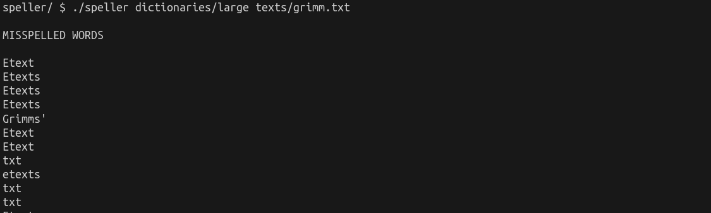
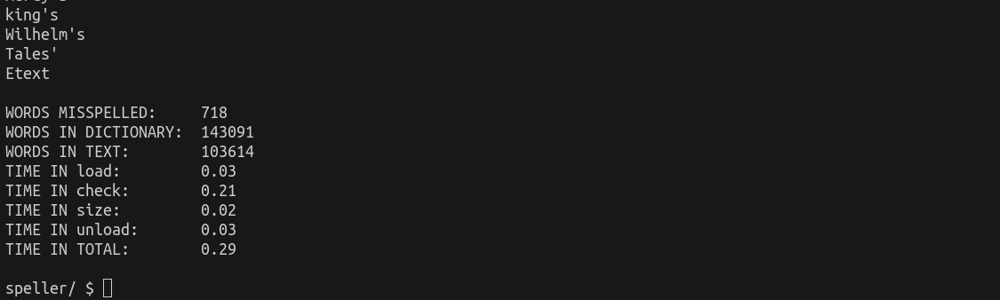

# Spell Checker Implementation

## Introduction

The task at hand is to implement a fast and efficient spell checker in C. The program consists of three main files: dictionary.h, dictionary.c, and speller.c. The spell checker loads a dictionary of words from a file, checks the spelling of words in a given text file, and reports any misspelled words.

## dictionary.h

Constants

    LENGTH: A constant representing the maximum length of a word in the dictionary (45 characters).

Function Prototypes

    bool check(const char *word): Checks if a given word is in the dictionary.
    unsigned int hash(const char *word): Computes the hash value for a given word.
    bool load(const char *dictionary): Loads the dictionary from a file into memory.
    unsigned int size(void): Returns the number of words in the dictionary.
    bool unload(void): Unloads the dictionary from memory.

## dictionary.c

Struct:

    node: Represents a node in the hash table.

Global Variable:

    table: An array of node pointers representing the hash table.

Functions

    bool check(const char *word): Checks if a given word is in the dictionary.
    unsigned int hash(const char *word): Computes the hash value for a given word.
    bool load(const char *dictionary): Loads the dictionary from a file into memory.
    unsigned int size(void): Returns the number of words in the dictionary.
    bool unload(void): Unloads the dictionary from memory.

## speller.c

This file contains the main program logic for the spell checker. It uses the implemented functions from dictionary.c to load the dictionary, check the spelling of words in a text file, and provide statistics on the execution time.

Usage: speller [dictionary] text

    dictionary (optional): File containing a list of lowercase words, one per line.
    text: File to be spell-checked.

## Makefile

The Makefile automates the compilation process for the program.
Commands

    make speller: Compiles the main program.
    make dictionary.o: Compiles the dictionary file.
    make clean: Removes compiled files.

Testing

Several text files are provided in the texts/ directory for testing the spell checker. The output of the program includes a list of misspelled words and various statistics, such as the time spent on loading, checking, sizing, and unloading the dictionary.

Note: The efficiency of the spell checker can be improved by re-implementing the functions in dictionary.c for optimal performance.

